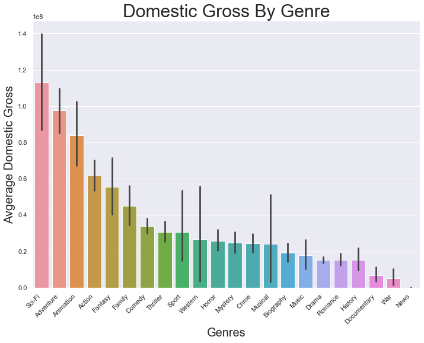
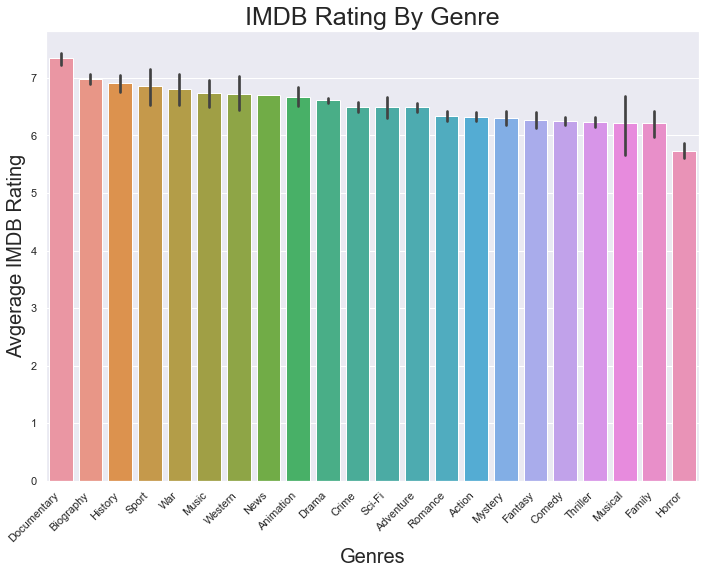
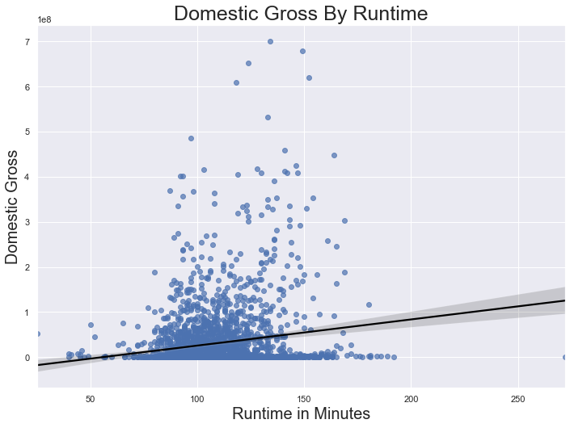

# Phase 1 Project

**Author**: [Henry Van Gorp](mailto:henrysvangorp@gmail.com)

## Project Overview

This project analyzes data from the biggest movie related websites to help Microsoft understand where current oppurtunities lie in the realm of film.  The popular websites of IMDB and Box Office Mojo provided the necessary data to create the analysis.  Analysis of the previously mentioned data shows that the genre sci-fi averages the highest domestic gross while documenteries have the highest average score on IMDB.  Also, the recommendation that movies which have a runtime of 100 to 150 minutes average the highest domestic gross was put foward.  Microsoft is able to utlize the findings and recommendations produced while entering the movie sphere.

## Business Problem

Microsoft sees all the big companies creating original video content and they want to get in on the fun. They have decided to create a new movie studio, but they don’t know anything about creating movies. This project explores what types of genres are currently doing the best at the box office with Domestic Gross as well as scoring the highest on IMDB.  Ths project also looks at runtime in comparison to domestic gross.  Utilizing this information, microsoft will be given three business recommendations to utilize as they enter this world.

## Data Understanding

The data which is being utlized for this project focuses on domestic gross, IMDB score, and runtime.  The data used in the analysis below came from reputable and popular movie based websites (IMDB & Box Office Mojo) which focus on box office revenue, overall movie rating and details of movies (i.e. runtime in mimutes).

## Data Preperation

This project utilizes descriptive and predictive analysis.  This provides and overview of how genres have succeeded in the categories of domestic gross and IMDB scoring as well as predicting how a film can benefit from utilizing a range in runtime.

## Data Anlysis

After merging the necessary tables together, the data was in a place where analysis could be begun.  Utilizing pandas, the data was able to get to aplace wher visualizations were created with seaborn.

## Results

Sci-Fi Averages the highest domestic gross:

Documentaries has the highest average IMDB score:

A runtime that is between 100 and 150 minutes produces the highest domestic gross:

## Evaluations

The work which I have provided above will help with the business problem given.  It will guide in not only the genres which should be prioritized but also one of the most ciritical aspects of a film, the runtime.

## Conclusions

This analysis leads to three recommendations on where Microsoft should focus in the film industry when creating original content:

- Focus on the top three genres who average the highest domestic gross.  The following genres in order are Sci-Fi, Adventure, and Animation.
- Regarding how films are rated, it is worth noting that Sci-Fi, even though averaging the highest domestic gross falls in the middle of the pack when it comes to IMDB Score.  Documentaries, Biographies, and History have the highest IMDB Score.
- Look to create films that average a runtime between 100 to 150 minutes.  These films produce the highest domestic gross.